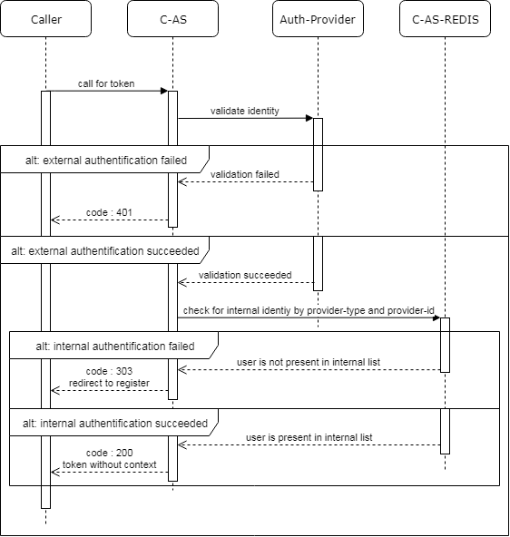
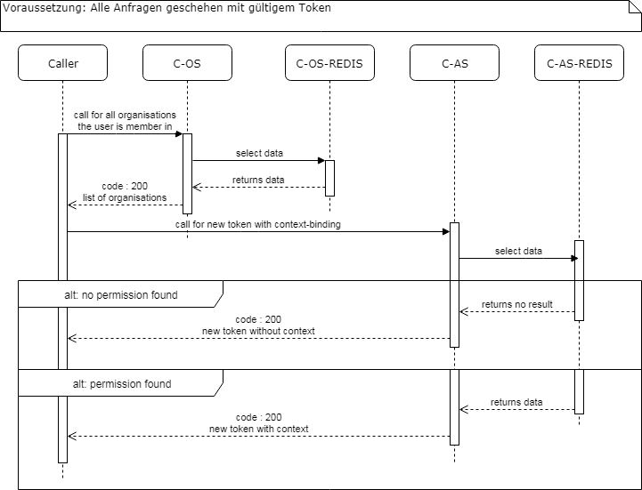

# Registrierung, Anmeldung und Abmeldung (Nr. 1)

## Registrierung (Nr. 1-1)

*TODO*

## Anmeldung (Nr. 1-2)

Ohne die Anmeldung ist keine Verwendung der Services möglich. Über Token, die 
mit einer private-public-Key-Kombination gesichert sind, wird den Services
mitgeteilt, dass der Token gültig ist, wie lange er noch gültig ist und welche
Rechte dem Benutzer zugeordnet sind.

Der Anmeldung liegt eine Authentifizierung in zwei Schritten und eine 
Authorisierung zu Grunde, die in erster Instanz immer kontext-frei geschieht.

#### Kontextfreie Anmeldung

Zunächst authentifiziert sich der Benutzer extern und intern. Gelingt diese 
Authentifizierung werden ihm grundlegende Rechte ausgestellt und kontext-freie
Eigenschaften wie System-Administrator gegeben.

#### Kontextgebundene Anmeldung

Um Zugriff auf konkrete Daten und Anwendungen zu erhalten, muss der Benutzer 
seinen Token an einen Kontext, d.h. eine Organisation binden. Besitzt der 
Benutzer Berechtigungen auf die gewählte Organisation, so ist ihm ein neuer, 
mit mehr Details ausgestatteter Token auszustellen, ansonsten nur sein alter zu
erneuern.

## Abmeldung (Nr. 1-3)

*TODO*